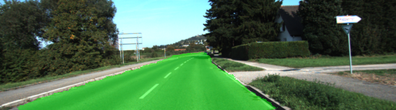
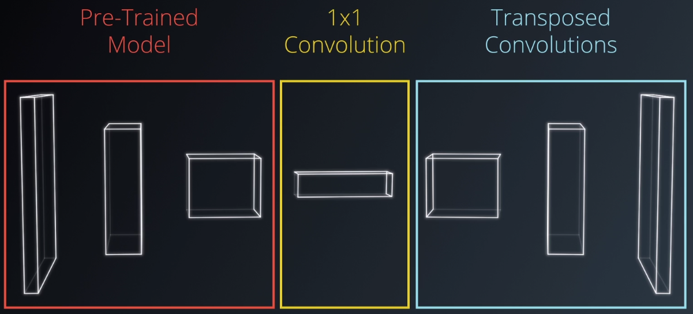
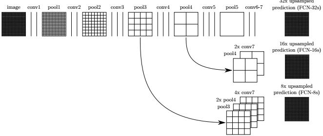
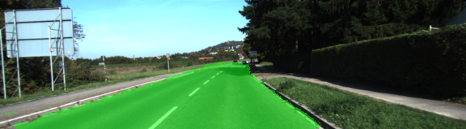
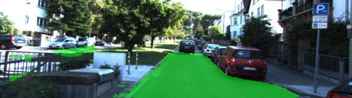

# Semantic Segmentation



The aim of this project is to provide scene understanding by labeling each pixel of an image as being road or not road using the Kitty dataset.
This will enable a self-driving car to determine the free navigable space on the road.
It requires knowledge of FCNs (Fully Convolutional Networks) to create a semantic segmentation model that classifies each pixel.

## FCNs Vs CNNs
FCNs allow us to identify where in the image is a given object because, contrary to CNNs, FCNs preserve spacial information.
The spacial information is preserved by adding skip connections.

A FNC differs from a CNN by replacing the last layer of a CNN by a 1x1 Convolutional layer and then a series of 'deconvolution' layers.



There are 3 key steps that characterise FCNs:
- 1x1 Convolution
- Transposed convolutions (or deconvolutions)
- Skip connections

One effect of convolutions or encoding in general is that it narrows down the scope by looking closely at some features and lose the "big picture" as a result.
Skip connections allow us to retain that information.The skip connections allow the network to use information from multiple resolutions.


This project requires a lot of computation power. The training was done in AWS (Amazon Web Services).

We used a pre-trained model for our encoder part.
In this case we used a pre-trained VGG network.
We should use skip connections with care. When using VGG-16 as the encoder only the 3rd and 4th pooling layers are tipiclly used for skip connections.

## Bounding Boxes Vs FCNs

Bounding boxes state-of-the-art solutions like YOLO and SSD models are only good for detecting cars, people, traffic lights, but not road or sky which do not fit properly in a box.
Semantic Segmentation using FCNs assing meaningful information to each individual pixel in the image.

## Implementation details

We implemented a model similar to the one found in the paper:
https://people.eecs.berkeley.edu/~jonlong/long_shelhamer_fcn.pdf



* Number of epochs used for training: 20
* Number of batches per epoch: 10
* Learning rate: 0.001


## Instructions for Running on AWS (Amazon Web Services)

1) Log in to EC2 management console, region Ohio
2) Instances -> spot requests -> Request Spot Instances
3) Search for AMI -> Communiti AMI -> udacity-carnd-advanced-deep-learning - ami-854464e0
4) Instances type(s) select -> g3.4xlarge
5) Network default
6) Next
7) EBS volumes -> Delete: uncheck mark (important: storing the data when instance is terminated will be charged additionally)
8) Key pair name -> create new key pair -> update -> choose
9) Security group -> create new -> add SSH and custom TCP for port 8888  (Inbound only)
10) Review -> Launch
11) Instances -> when Instance State = Running -> right click -> Connect
12) Follow instructions for ssh connection

## Results

The training took about 20 minutes in a AWS.
Here are some examples from test images.
We can see that it works quiet well in general and is able to correctly label more than 80% of the road pixels.







## Setup

##### Frameworks and Packages
Make sure you have the following is installed:
 - [Python 3](https://www.python.org/)
 - [TensorFlow](https://www.tensorflow.org/)
 - [NumPy](http://www.numpy.org/)
 - [SciPy](https://www.scipy.org/)

##### Dataset

Download the [Kitti Road dataset](http://www.cvlibs.net/datasets/kitti/eval_road.php) from [here](http://www.cvlibs.net/download.php?file=data_road.zip).  Extract the dataset in the `data` folder.  This will create the folder `data_road` with all the training a test images.

### Start

##### Implement

Implement the code in the `main.py` module indicated by the "TODO" comments.
The comments indicated with "OPTIONAL" tag are not required to complete.

##### Run

Run the following command to run the project:
```
python main.py
```
**Note** If running this in Jupyter Notebook system messages, such as those regarding test status, may appear in the terminal rather than the notebook.

### Submission

1. Ensure you've passed all the unit tests.
2. Ensure you pass all points on [the rubric](https://review.udacity.com/#!/rubrics/989/view).
3. Submit the following in a zip file.
 - `helper.py`
 - `main.py`
 - `project_tests.py`
 - Newest inference images from `runs` folder
